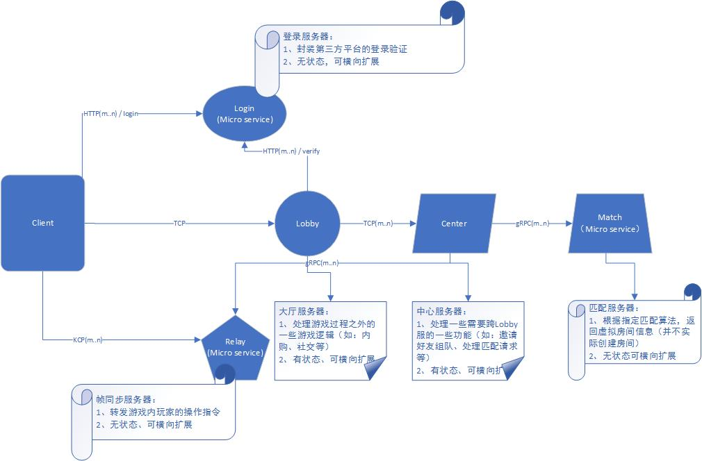

### 架构图

以下是球球大作战早期版本的架构图。

本教学出于简单考虑，下图中除了 RoomServer, 其他服务器都不开启。
客户端跳过 LoginServer 直接连接 RoomServer.

以下是孵化部手游服务器的架构图。
其中 Relay 服即房间服，对于帧同步游戏，可实现为通用的微服务。

### 架构图脉络

服务器架构，可以概括为3条线：

  - 登录，验证帐号密码，并获取大厅服地址
  - 大厅，组队，匹配战斗，分配一个房间服地址
  - 房间，多人连线战斗

RoomServer 由于各游戏核心玩法不一样，通常是大动干戈的一块内容。

本教学中，客户端直接连接一个固定的房间服。
在房间服上除了战斗逻辑，还须实现简单的帐号验证和战斗匹配。
省略了专门的登录服和大厅服，同时也不考虑大负载时开启多个房间服的需要。
