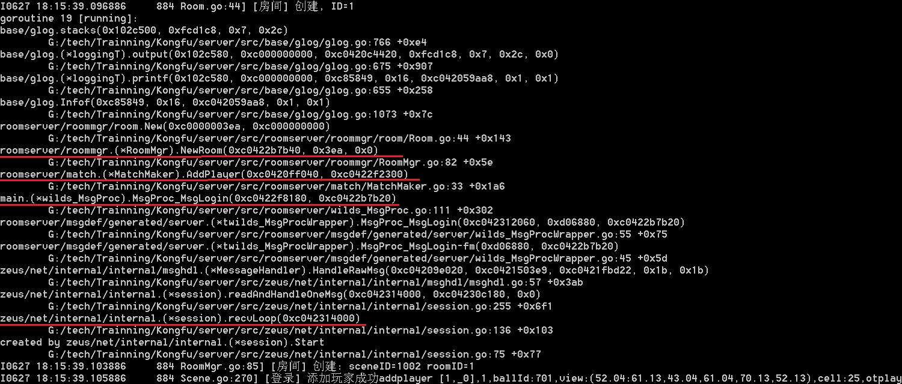

### 创建房间何时被触发

1. 客户端连接RoomServer
1. 客户端发送MsgLogin

  

  根据上图，可以看出：
  - MsgLogin消息，触发 MsgProc_MsgLogin(...)
  - 匹配管理器 MatchMaker 调用 AddPlayer 函数，做匹配逻辑处理
  - 房间管理 RoomMgr 调用 NewRoom 函数，开始创建房间
  - 房间类 调用 room.New() 开始创建房间

##### 小技巧

常见的，我们很容易定位具体代码实现，如 NewRoom 函数。

有时需要知道该函数的调用流程。这个时候，通常有2种方法：

  1. 通过函数调用栈

     比如，上图就是通过命令启动RoomServer，该行被触发时会打印函数调用栈：
     ```
     roomserver.exe -alsologtostderr=true -log_backtrace_at=Room.go:44  （44: 行号所在的位置，必须是glog库被调用语句）
     ```
     也可以在函数体内添加 glog.Info(string(debug.Stack())) 来打印函数调用栈

  2. Ctrl + Shift + F，全局查询关键字，如 NewRoom

     通过搜索关键字，代码分析之

两种技巧，都是码农必须熟练掌握的！


### 房间与房间管理器

- RoomServer的功能，按照面向对象的思维，可以抽象出以下对象，及关系：

  - 1个RoomServer -> 1个房间管理器 -> N个房间

  - 1个房间 -> 1个房间列表 -> N个玩家

  - 其他，如场景、游戏对象等，这里略（所有对象及关系见[1.房间类关系图](1.房间类关系图.md )）

    RoomServer中房间管理器由RoomMgr.go实现；房间由Room.go实现。

- 然后就是根据业务逻辑确定对象间的交互流程


##### 小技巧

类似有上述关系的系统还有很多很多，如背包系统、邮件系统、好友系统等等。

所以抛开这些系统的业务逻辑差异，它们的骨架大多都是一致的：**就是在某数据结构上的增删改操作**。


### 项目中房间管理代码分析 - RoomMgr.go

RoomMgr.go，就是对房间进行管理

  - 数据结构

    ```go
    type RoomMgr struct {
    	mutex sync.RWMutex // protect rooms
    	rooms map[types.RoomID]*rm.Room
    }
    ```
    - RoomMger 维护 rooms 字段
    - mutex 为了多协程安全用，语义上非必须字段


  - 创建房间

    ```go
    func (r *RoomMgr) NewRoom(sceneId types.SceneID) *rm.Room {
    	r.mutex.Lock()
    	room := r.addRoom(rm.New(sceneId))
    	r.mutex.Unlock()

    	glog.Infof("[房间] 创建: sceneID=%d roomID=%d", sceneId, room.ID())
    	return room
    }
    func (r *RoomMgr) addRoom(room *rm.Room) *rm.Room {
    	r.rooms[room.ID()] = room
    	return room
    }
    ```

  - 删除房间

    ```go
    func (r *RoomMgr) RemoveRoom(rid types.RoomID) {
    	r.mutex.Lock()
    	delete(r.rooms, rid)
    	r.mutex.Unlock()
    }
    ```

  - 客户端登录RoomServer，发送MsgLogin触发创建房间逻辑

    本文第一节内容，略

  - 定期触发删除房间逻辑

    ```go
    func (r *RoomMgr) init() {
    	go func() {
    		tick := time.NewTicker(time.Second * 1)
    		// ...略去无关代码...
    		for {
    			select {
    			case <-tick.C:
    				r.timeAction()
    			}
    		}
    	}()
    }
    // 定时事件
    func (r *RoomMgr) timeAction() {
    	r.mutex.RLock()
    	rms := r.getClosedRooms()
    	r.mutex.RUnlock()

    	// 删除已关闭房间.
    	for _, room := range rms {
    		r.RemoveRoom(room.ID())
    	}
    }
    ```
    定时调用 getClosedRooms() 函数，获取已关闭的房间列表；对已关闭的房间，做清除

##### 小技巧

增删改操作与对象的生命周期。有“增”就需有“删”操作。

写代码时，对每类对象的如何被创建、何时会被删除的生命周期，要做到了如指掌。（即使是写GO语言也一样）


### 项目中房间主循环代码分析 - Room.go

*练习，Room.Loop函数如何被触发*

Room.Loop 房间主循环，非常重要。

房间主循环按照规定的频率，计算一局游戏的每一帧，并按规定的频率将结果反馈给客户端。

这里着重看下，房间主循环：

```go
func (r *Room) Loop() {
	timeTicker := time.NewTicker(time.Millisecond * consts.FrameTimeMS)

	defer func() {
		timeTicker.Stop()
		if err := recover(); err != nil {
			glog.Error("[异常] 房间线程出错 [", r.id, "] ", err, "\n", string(debug.Stack()))
		}
	}()

	for {
		select {
		case <-timeTicker.C:
			r.render()
		case act := <-r.actC:
			act()
		case <-r.doneC:
			assert.True(r.IsClosed())
			return
		}
	}
}
```

timeTicker.C达成按频率调用render()。render()内是每帧房间游戏逻辑

r.actC达成 玩家操作处理、房间事件处理等 投递到房间主循环来执行。这里涉及到一个Go协程的编程模型。（下节内容）

**Room.go需要做到通读，理解其中的每个函数是干嘛的。**
