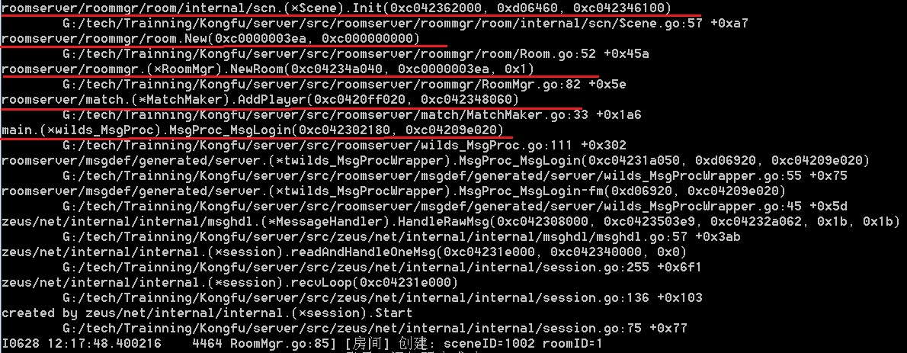

### 场景创建何时被触发

场景被创建发生在房间被创建时。



在 NewRoom() -> room.New() -> room.scn.Init(room) 开始整个场景的搭建工作。
```go
func New(sceneID types.SceneID) *Room {
	id := generateRoomID()
	glog.Infof("[房间] 创建, ID=%d", id)
	room := &Room{
		id:      id,
		scn:     scn.New(sceneID),
		endTime: time.Now().Unix() + consts.DefaultPlayTime, // 10min为一局
		actC:    make(chan func(), 1024),
		doneC:   make(chan bool),
	}
	room.scn.Init(room)

	// 开启逻辑处理协程
	go room.Loop()

	return room
}
```

### 场景中有哪些部分组成

对象      | 说明
---------|-------
静态障碍物| 场景的基本构成部分。
食物     | 在场景中动态生成、可以被吃、定时刷新
动态障碍物| 在场景中动态生成、可以被敲碎、定时刷新
玩家     | 可以操纵的角色


### 项目中创建场景代码分析 - Scene.go

```go
func (s *Scene) Init(room _IRoom) {
	glog.Info("Scene Init")
	s.room = room

	s.mapConfig = conf.GetMapConfigById(s.SceneID())
	s.scenePhysic = physic.NewScenePhysic()
	s.Players = make(map[types.PlayerID]*plr.ScenePlayer)
	s.loadMap()
	for i := 0; i < s.cellNumX*s.cellNumY; i++ {
		s.cells = append(s.cells, cll.NewCell(i))
	}
	s.birthPoints.CreateAllBirthPoint(s)
}
```

主要包括创建下面的内容：

  - 创建物理层（ s.scenePhysic = physic.NewScenePhysic()  ）
  - 创建静态障碍物分布（ s.loadMap() ）
  - 创建Cell（ this.cells = append(this.cells, cll.NewCell(i)) ）
  - 创建食物、动态障碍物分布（ s.birthPoints.CreateAllBirthPoint(s) ）


### 如何表示测试场景

服务器端，编码特点上，通常都是逻辑，比较难测试全面。

因此需要某些具象化的辅助测试。

**这样在服务器端与客户端联调代码前，能把低级错误、或某些明显的错误给修掉。**


### py_guiclient场景表现示例


如图，这样可以清晰的知道场景构建是否有错误。

借助简单的辅助工具，先走通一遍流程。这样可以让自己的代码在与客户端联调时的更顺利开展。


##### 小技巧 go test test & benchmark

`go test` 命令是golang官方提供的单元测试、基准测试工具。

对于某些单元测试、基准测试，推荐使用go test。

具象化的辅助测试工具，如 py_guiclient，有利于测试跑通流程；

单元测试、基准测试，如 go test ，有利于固化测试用例，解放测试人力。


