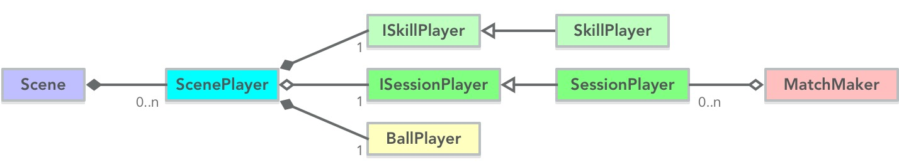
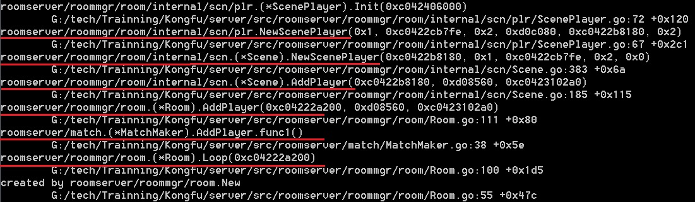
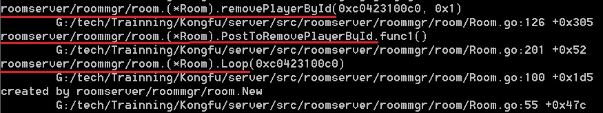

### 角色相关类图



游戏角色代表一个玩家，包含不少功能。Kongfu划出下面几大类：

- 游戏角色基本信息
- 网络会话相关的
- AOI视野相关的
- 技能相关的

类            | 说明
--------------|-------------------------------------------------
ScenePlayer   | 包含了游戏角色基本信息，并把 网络会话相关的、AOI视野相关的、技能相关的功能，来表示一个游戏角色
SessionPlayer | 代表网络会话的角色类，匹配器管理匹配 SessionPlayer
BallPlayer    | 代表场景游戏对象的角色类，AOI视野管理 BallPlayer
SkillPlayer   | 有技能功能的角色类，该部分实现技能


### 角色创建何时被触发

使用下列命令开启 RoomServer :

```shell
roomserver.exe -alsologtostderr=true -log_backtrace_at=ScenePlayer.go:72
```

然后开几个客户端，界面提示：



可以看出：

- Room.Loop 中创建 ScenePlayer （游戏逻辑都是在房间主循环中处理）
- MatchMaker 投递 AddPlayer，来触发 Room.Loop 执行创建 ScenePlayer


### 角色离开何时被触发

使用下列命令开启 RoomServer :

```shell
roomserver.exe -alsologtostderr=true -log_backtrace_at=Room.go:126
```

然后开几个客户端进入游戏，并退出，界面提示：



可以看出：

- Room.Loop 中删除 ScenePlayer （游戏逻辑都是在房间主循环中处理）
- 通过， PostToRemovePlayerById 函数，来触发 Room.Loop 执行删除 ScenePlayer

搜索下，PostToRemovePlayerById 关键字，可以看到：

```go
func (s *SessionEvtSink) OnClosed(sess server.ISession) {
	data := sess.GetUserData()
	if data == nil {
		glog.Infof("Closed %d %s", sess.GetID(), sess.RemoteAddr())
		return
	}

	player := data.(*SessionPlayer)
	glog.Info("[注销] ID=", player.PlayerID())

	room := roommgr.GetMe().GetRoomByID(player.RoomID())
	if room == nil {
		return
	}

	// 下线从房间删除
	room.PostToRemovePlayerById(player.PlayerID())
}
```

可以看出，当玩家网络会话结束时，即断开连接时，玩家退出房间
