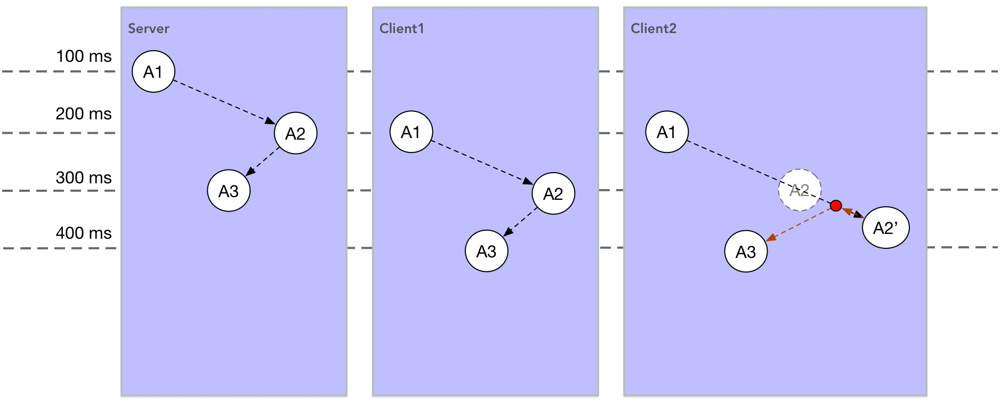

### 关于移动同步

首先需要知道，不同的游戏类型、玩法，会有不同的移动同步方法。

Kongfu 采用的移动同步方法为：

1. 所有移动过程均在服务器端计算
1. 服务器每隔 100ms 发送一次移动状态包
1. 客户端根据最新的移动状态包，做追随移动

图解下上述过程：



理想状态下，会像 Client1 ，客户端相当于服务器延迟 100ms 帧播放器。

现实情况下，由于网络波动，会像 Client2 ，如 A2 点会有抖动现象。

在一定网络延迟和丢包率区间内，肉眼是看不出抖动的。


### MsgMove 协议

```protobuf
message MsgMove {
    required int32 angle = 1;   // 移动方向
    required int32 power = 2;   // 力
    optional uint32 face = 3;   // 球朝向的目标球ID
}
```

  - angle

    因为在服务端计算移动，因此需要让服务器知道移动的方向

    angle 表示 0 - 360 度，通过计算可以得到 方向向量

  - power

    取值 0 或 1 ， 0 停止移动， 1 可以移动

  - face

    游戏角色身体朝向可能与移动方向不一样，因此有这个字段


### 项目移动代码分析 - ScenePlayer.go / BallPlayer.go

  - 移动请求

      ```go
      func (this *ScenePlayerNetMsgHelper) OnNetMove(op *usercmd.MsgMove) {
      	if power, angle, face, ok := this.selfPlayer.CheckMoveMsg(float64(op.Power), float64(op.Angle), op.Face); ok {
      		this.selfPlayer.Move(power, angle, face)
      	}
      }
      ```
      收到 MsgMove 消息后， 会触发调用 OnNetMove

      ```go
      func (this *MoveHelper) CheckMoveMsg(power, angle float64, face uint32) (float64, float64, uint32, bool) {
      	if this.lastMoveTime == 0 {
      		this.lastMoveTime = time.Now().Add(time.Second).Unix()
      	}
      	if this.lastMoveops > MAX_OPS_MOVE {
      		now := time.Now()
      		if this.lastMoveTime > now.Unix() {
      			return 0, 0, 0, false
      		}
      		this.lastMoveTime = now.Add(time.Second).Unix()
      		this.lastMoveops = 0
      	}
      	this.lastMoveops++

      	power = math.Min(math.Max(0, float64(power)), 100) * 0.01
      	angle = math.Min(math.Max(0, float64(angle)), 360)
      	if this.cacheAngle != power || this.cacheangle != angle || this.cacheFace != face {
      		this.cacheAngle = power
      		this.cacheangle = angle
      		this.cacheFace = face
      		return power, angle, face, true
      	}
      	return 0, 0, 0, false
      }
      ```
      OnNetMove 函数首先检查下移动请求包是否合法。

      ```go
      func (s *ScenePlayer) Move(power, angle float64, face uint32) {
      	if power != 0 {
      		power = 1 // power恒为1,减少移动同步影响因素
      	}
      	s.Power = power
      	s.Face = face
      	if power != 0 {
      		s.Angle = angle
      	}
      	if power == 0 {
      		s.isRunning = false
      	}
      }
      ```
      然后保存移动请求信息，等待房间主循环下一帧，来计算移动逻辑。


  - 帧驱动，计算玩家移动
      ```go
      func (s *ScenePlayer) Update(perTime float64, now int64, scene IScene) {
      	// ... 无关代码这里省略 ...

      	// 玩家球移动
      	s.UpdateMove(perTime, frameRate)

      	s.UpdateView(scene)

      	// ... 无关代码这里省略 ...

      	// 更新视野中的玩家
      	s.UpdateViewPlayers(scene)

      	// ... 无关代码这里省略 ...
      }
      ```
      ScenePlayer.Update 每帧都会被调用

      调用过程：Room.Loop => Room.render => Scene.Render => ScenePlayer.Update

      ScenePlayer.Update 内会调用 ScenePlayer.UpdateMove 来计算移动过程


  - 计算移动
      ```go
      func (s *ScenePlayer) UpdateMove(perTime float64, frameRate float64) {
      	if !s.IsLive {
      		return
      	}

      	// 玩家球移动
      	ball := s.SelfBall
      	ball.UpdateForce(perTime)
      	if ball.Move(perTime, frameRate) {
      		ball.FixMapEdge() //修边
      		s.isMoved = true
      		ball.ResetRect()

      		// 扣蓝
      		if s.isRunning {
      			cost := frameRate * float64(consts.FrameTimeMS) * consts.DefaultRunCostMP
      			diff := ball.GetMP() - cost
      			if diff <= 0 {
      				s.isRunning = false
      			} else {
      				ball.SetMP(diff)
      			}
      		}
      	}
      }
      ```
      每帧都会计算移动。 UpdateMove 主要做了下面的事情：
      - 更新外部迫力（ball.UpdateForce(perTime)）
      - 计算移动（ball.Move(perTime, frameRate)）
      - 修正位置（ball.FixMapEdge()，如超出边界）
      - 扣蓝


  - 移动计算细节
      ```go
      func (this *BallPlayer) Move(perTime float64, frameRate float64) bool {
      	// 有推力情况下， 忽略原来速度方向
      	if this.HasForce() == true {
      		force := this.GetForce()
      		pos := this.PhysicObj.GetPostion()
      		this.Pos = util.Vector2{float64(pos.X), float64(pos.Y)}
      		this.PhysicObj.SetVelocity(&bmath.Vector2{float32(force.X), float32(force.Y)})
      		return true
      	}

      	pos := this.PhysicObj.GetPostion()
      	this.Pos = util.Vector2{float64(pos.X), float64(pos.Y)}

      	speed := consts.DefaultBallSpeed

      	powerMul := util.Clamp(this.player.GetPower(), 0, 1)

      	if this.player.IsRunning() {
      		speed *= consts.DefaultRunRatio
      		powerMul = 1
      	}

      	speed *= powerMul
      	this.speed = *this.angleVel.MultiMethod(speed)

      	vel := this.speed
      	vel.ScaleBy(frameRate) //几帧执行一次物理tick
      	if 0 == this.player.GetPower() {
      		this.PhysicObj.SetVelocity(&bmath.Vector2{0, 0})
      	} else {
      		this.PhysicObj.SetVelocity(&bmath.Vector2{float32(vel.X) / 30, float32(vel.Y) / 30})
      	}

      	return true
      }
      ```
      这里看似很多代码，实际上就做了3个事情：
      - 从base/ape中，获取本球的实际位置（ pos := this.PhysicObj.GetPostion() ）
      - 计算本帧的期望位移大小
      - 把算好的期望位移传递给base/ape。（ this.PhysicObj.SetVelocity( ... ) ）

      在下一帧，执行本函数之前，base/ape内部会根据传递给它的期望位移，算出实际位移。然后又重复1、2、3这3个步骤


### 项目移动状态同步代码分析 - ScenePlayer.go

```go
func (s *ScenePlayer) SendSceneMsg() {
	// ... 代码略 ...
}
```

每 100ms ，调用 SendSceneMsg ，把视野内所有球的移动状态信息通过 MsgSceneUDP 协议发给客户端。

调用过程：Room.Loop => Room.render => Scene.Render => Scene.render5 => Scene.sendRoomMsg => ScenePlayer.SendSceneMsg


### 角色奔跑

奔跑与移动的区别，仅在于角色每帧位移大小不一样。

- 协议 MsgRun

    ```protobuf
    message MsgRun
    {
    }
    ```

- MsgRun 协议处理

    ```go
    func (p *Proc_wilds) MsgProc_MsgRun(msg *usercmd.MsgRun) {
    	if p.CheckPlaying() == false {
    		return
    	}

    	p.room.PostAction(func() {
    		p.scenePlayer.OnRun(msg)
    	})
    }
    func (this *ScenePlayerNetMsgHelper) OnRun(op *usercmd.MsgRun) {
    	this.selfPlayer.Run(op)
    }
    func (s *ScenePlayer) Run(op *usercmd.MsgRun) {
    	if s.isRunning {
    		return
    	}
    	if s.Power == 0 {
    		return
    	}
    	if s.Skill.GetCurSkillId() != 0 {
    		return
    	}
    	s.isRunning = true
    }
    ```

    收到 MsgRun 协议，标志 ScenePlayer.isRunning 为 true

- 每帧计算角色移动（奔跑）

    ```go
    func (this *BallPlayer) Move(perTime float64, frameRate float64) bool {
    	//... 无关代码略 ...

    	if this.player.IsRunning() {
    		speed *= consts.DefaultRunRatio
    		powerMul = 1
    	}

    	//... 无关代码略 ...
    }
    ```

    计算移动位移时，如果 isRunning() ，则 速度值做修正，速度更大。
