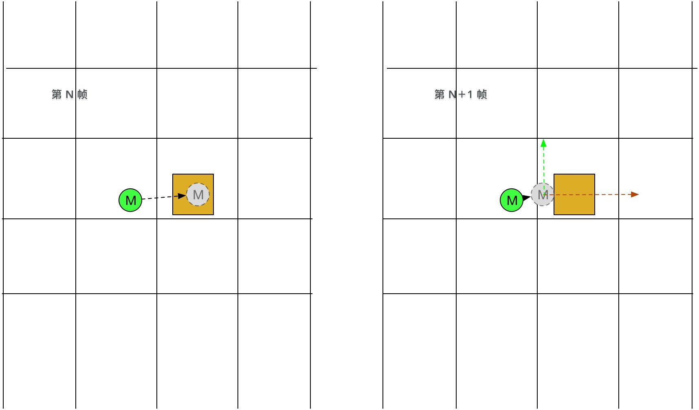
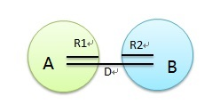

### 通过 base/ape 的碰撞修正

前面章节[角色移动奔跑](2.角色移动奔跑.md)中，介绍过。

  - 根据方向、速度算出位移，得到期望位置
  - 通过 base/ape 修正，获取正确位置

如图：



橙色方块是场景中静态障碍物。在第 N 帧，角色 M 的期望位置在橙色方块上。

第 N+1 帧，先执行 base/ape 模拟，可以得到角色 M 的正确位置。

角色 M 的移动状态不变的情况下， 期望位移会被分解成 +x +y 方向的两个分量。

角色 M 将沿着方块表面朝上移动。


### 玩法中的碰撞检测

有时候，2个游戏对象间是否有碰撞，还需要自己写代码实现。

主要原因有2：

  - base/ape 库功能比较弱，没有提供应用层的碰撞事件接口
  - 有些是“伪”碰撞，比如玩家B是否在玩家A的攻击范围内

Kongfu 中没有使用 base/ape 来处理这种碰撞。

是按下面的方式完成的，如图：



- 相碰：D <= R1+R2
- 没有相碰：D > R1+R2

*(如果是方形，与上面类似，自己做推导碰撞公式)*


类似代码实现：
```go
func IsCanAttackPlayer(tick *b3core.Tick, player *plr.ScenePlayer, target *bll.BallPlayer) bool {
	// ...无关代码略...
	distance := player.SelfAnimal.SqrMagnitudeTo(target)
	eatRange := GetAttackRange(tick, player)
	return distance <= (eatRange+target.GetRect().Radius)*(eatRange+target.GetRect().Radius)
}
```

IsCanAttackPlayer 函数为 Kongfu 技能模块中用来判断 玩家是否可以达到目标玩家。


### 获取某范围内游戏对象

想要做碰撞检测，必须先要有手段获取场景中的游戏对象。

场景对象可以分为2类：玩家对象，其他游戏对象。

#### 玩家对象

Kongfu 场景中玩家不会很多，如10个。因此可以直接获取场景玩家列表，进行遍历，然后做碰撞检测，再实施某些玩法逻辑。

即直接遍历： ScenePlayer的Others字段即可


#### 其他游戏对象

Kongfu 场景中有很多食物等，吃食物时，遍历所有食物，有大量食物时，会白白消耗CPU。因此会通过获取某范围内（如视野范围、攻击范围；纯粹远处某范围等）获取这些对象，然后做碰撞检测，再实施某些玩法逻辑。

思路如下：

先根据范围，获取范围内的灯塔集合cells，在遍历cells上的游戏对象，做碰撞检测，再实施某些玩法逻辑。

#### 主要参考函数：

- SelectTarget.go
```go
func FindTarget_Circle(tick *b3core.Tick, player *plr.ScenePlayer) ([]interfaces.IBall, []interfaces.BallKind) {
	var balllist []interfaces.IBall
	var balltype []interfaces.BallKind

	// player
	for _, o := range player.Others {
		if o.IsLive == false {
			continue
		}
		ball := o.SelfAnimal
		balllist = append(balllist, ball)
		balltype = append(balltype, interfaces.BallKind_Player)
	}

	var rect util.Square
	rect.CopyFrom(player.GetViewRect())
	rect.SetRadius(GetAttackRange(tick, player))
	cells := player.GetScene().GetAreaCells(&rect)

	// ballskill
	for _, cell := range cells {
		for _, ball := range cell.Skills {
			balllist = append(balllist, ball)
			balltype = append(balltype, interfaces.BallKind_Skill)
		}
	}

	// feed
	for _, cell := range cells {
		for _, ball := range cell.Feeds {
			balllist = append(balllist, ball)
			balltype = append(balltype, interfaces.BallKind_Feed)
		}
	}
	return balllist, balltype
}
```

如代码所示例：
玩家对象直接 `for _, o := range player.Others {`

其他游戏对象，先通过GetAreaCell获取cells，在遍历cells获取上面的游戏对象。
